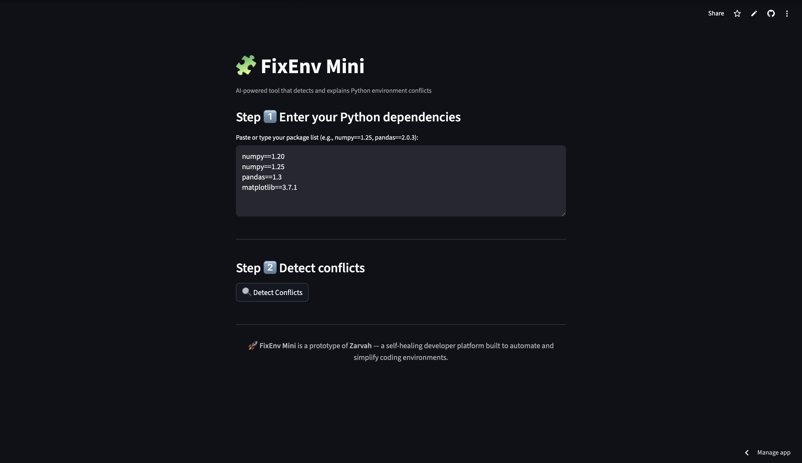
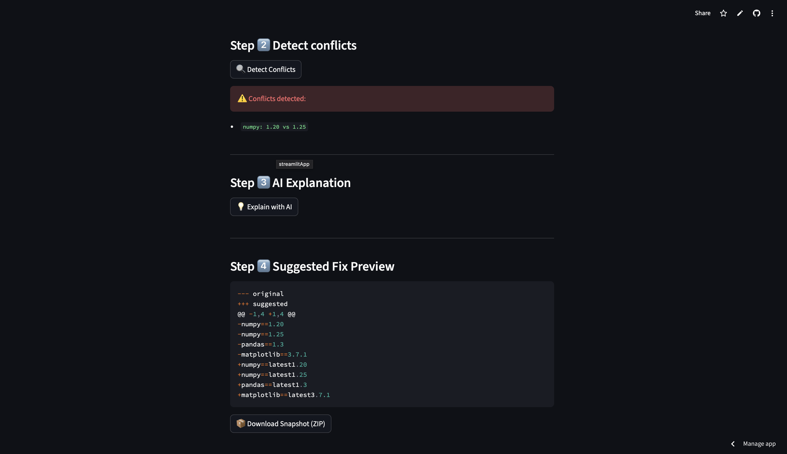
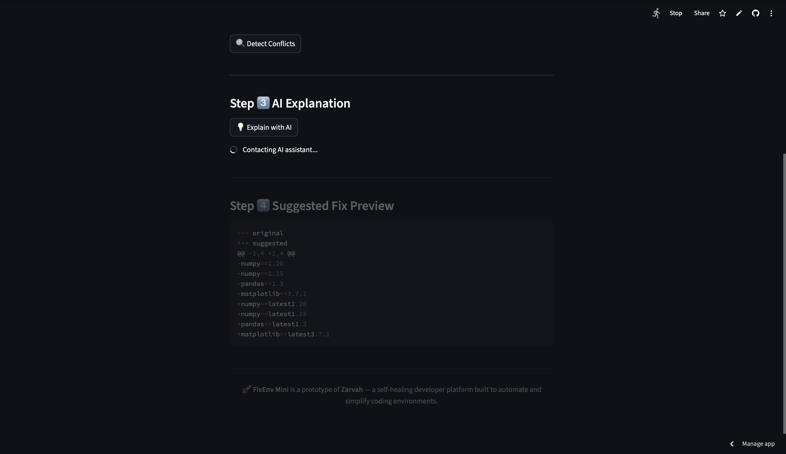
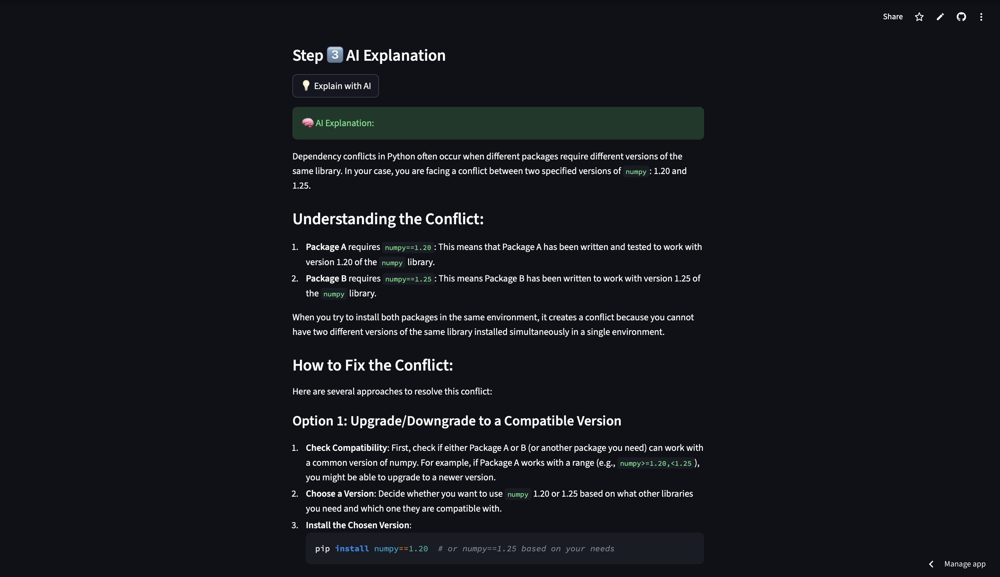
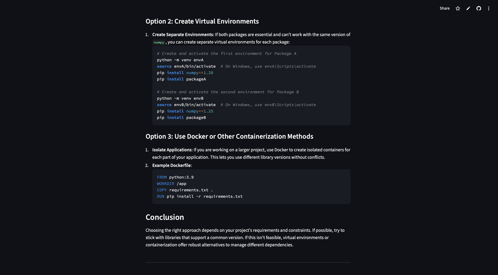
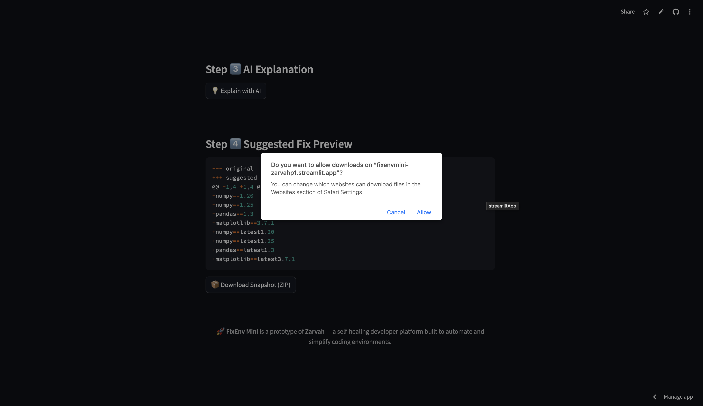

# 🧩 FixEnv Mini — Zarvah P1 Prototype

**FixEnv Mini** is an AI-powered tool that detects, explains, and fixes Python environment conflicts — prototype for Zarvah’s self-healing developer platform.

---

## 🌐 Live Demo
👉 [Launch on Streamlit Cloud](https://fixenvmini-zarvahp1.streamlit.app)

---

## ⚙️ Features
- Paste or type dependencies directly into the app.
- Quickly detects and highlights version conflicts with one click.
- Integrates with OpenAI API to explain and suggest fixes.
- Generates a before/after diff preview.
- Allows exporting a full snapshot as a ZIP file.

---

## 🖼️ Screenshots

### Workflow Overview  
From pasting dependencies to automatic detection, AI explanations, and downloadable snapshots.

| Home | ⚠️ Conflict Detected + Suggested Fix | 💡 AI Enquiry |
|:--:|:--:|:--:|
|  |  |  |

| 🧠 AI Explanation (Part 1) | 🧩 AI Explanation (Part 2) | 📦 Snapshot Download |
|:--:|:--:|:--:|
|  |  |  |

> *FixEnv Mini* walks users from conflict detection → AI reasoning → final export in seconds.
