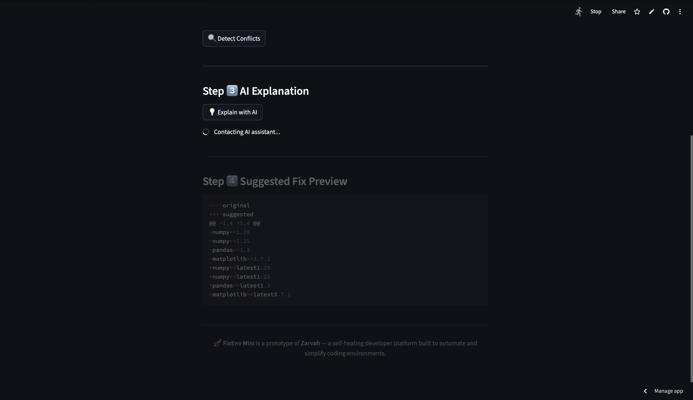

# 🧩 FixEnv Mini — Zarvah P1 Prototype

**FixEnv Mini** is an AI-powered environment conflict detector that automatically detects and explains Python dependency issues.  
It represents **Phase 1 of Zarvah**, a self-healing developer platform designed to remove friction from software environments.

---

## 🌐 Live Demo
Deployed on **Streamlit Cloud** — paste your requirements.txt, detect version conflicts, and let AI explain the fixes.

---

## ⚙️ Features
- Paste or type dependencies directly into the app.
- Auto-detects and highlights version conflicts.
- Integrates with OpenAI API to explain and suggest fixes.
- Generates a before/after diff preview.
- Allows exporting a full snapshot as a ZIP file.

---

## 🖼️ Screenshots

### Workflow Overview  
From pasting dependencies to automatic detection, AI explanations, and downloadable snapshots.

| 🧩 Home | ⚠️ Conflict Detected + Suggested Fix | 💡 AI Explaining |
|:--:|:--:|:--:|
|  |  |  |

| 🧠 AI Explanation (Part 1) | 🧩 AI Explanation (Part 2) | 📦 Snapshot Download |
|:--:|:--:|:--:|
|  |  |  |

> *FixEnv Mini* walks users from conflict detection → AI reasoning → final export in seconds.
